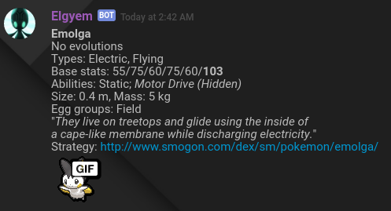
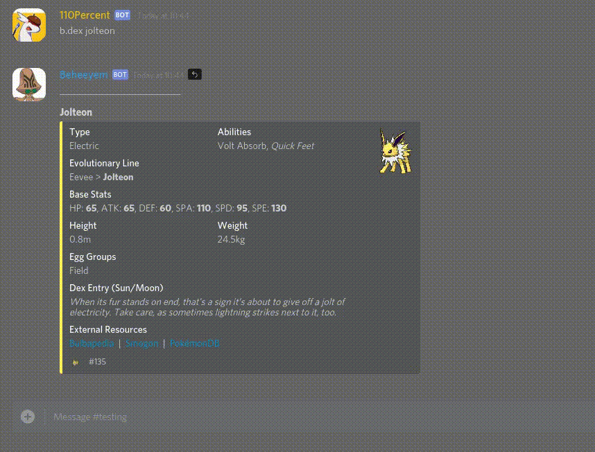

Travis information:  

Accessing Pokémon information on Discord has never been this easy!  
  
Discord is aimed at a specific target platform: Gamers. Over the past nearly two years, Discord has gathered together millions of gamers to connect with each other. A popular game played amongst these users is Pokémon. Whether it's the nostalgic feel of climbing aboard the *S.S. Anne*, or the adrenaline rush of finally getting to the Elite Four Champion, Pokémon has always been a cherished series for a variety of people.  
  
With the rising popularity of bots on Discord, people have been able to access information at an instant while they chat with their friends, without even having to open up their browser or game. Talk about convenience! A rising trend amongst bots is a Pokédex feature, giving you information of the Pokémon of your choice. This can be handy, but what if you need to know more? What if you need the Smogon rating of the *Swift Swim* ability? (It's 2.5, in case you were wondering.) How about the potential damage modifiers for a hypothetical Fairy/Poison/Flying-type, Pokémon? (It can take a lot of hits from a Bug-type move.) Good, reliable Pokémon-based bots can be hard to find, especially in such a big internet.  
  
Along came Elgyem. One of the official bots of the /r/Pokemon Discord server, this handy guy came with a lot of convenient commands to make fetching information about Pokémon quick and easy. People use it frequently and currently. There's a good chance someone's used it in the past minute!

 
  
However, even Elgyem has its flaws. Some of the commands are an eye-sore, making it difficult to read the information. Some data isn't formatted, leaving the user to decipher numbers and symbols. In addition, Elgy is closed-source. This means the code is kept private, meaning nobody can look around and see how it works, or provide any assistance to make it better.  
  
This is where Beheeyem steps in. This guy is designed as an elegant, fast and cleaner replacement for Elgyem, chock-full of utilities that are ready to be used by you and your friends. From Pokémon to Items to Abilities to Moves, Beheeyem has your back when it comes to the information you want.  
  
  
## Features
* Well-formatted commands to provide information on Pokémon, Moves, Abilities, Items, Types and more  
* Additional links to external resources such as Smogon, Bulbapedia and PokémonDB  
* Fancy colours!  
* Commands to make adding Beheeyem to your server easy as two clicks

  

## Adding Beheeyem to your server
Beheeyem can join your server in the easiest way! If you share a server with Beheeyem, type `b.invite` in a message to receive an invite link to allow the bot to your server.  
Alternatively, you could click [this link](https://discordapp.com/oauth2/authorize?client_id=246647016111865856&scope=bot&permissions=67488832) to invite Beheeyem to your server.